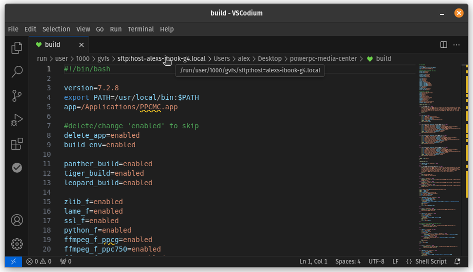

# Legacy SSH Enabler (LSSHE)

_By Alex Free_.

Legacy SSH Enabler fixes errors encountered when using a newer OpenSSH client to connect to an older SSH server (i.e. `Unable to negotiate with 10.0.0.72 port 22: no matching key exchange method found. Their offer: diffie-hellman-group-exchange-sha1,diffie-hellman-group1-sha1`). It also fixes errors encounter when using an older SSH client to connect to a newer OpenSSH server (i.e. `no kex alg`).

| [Homepage](https://alex-free.github.io/lsshe) | [Github](https://github.com/alex-free/legacy-ssh-enabler) |

## Table Of Contents

* [Downloads](#downloads)
* [Usage](#usage)
* [Before Legacy SSH Enabler](#before-legacy-ssh-enabler)
* [After Legacy SSH Enabler](#after-legacy-ssh-enabler)
* [Why Is This Needed?](#why-is-this-needed)
* [How Does This Work?](#how-does-this-work)
* [License](#license)
* [Building](build.md)

## Downloads

### Version 1.0 (10/3/2024)

----------------------------------------------------

*   [legacy-ssh-enabler-v1.0.zip](https://github.com/alex-free/legacy-ssh-enabler/releases/download/v1.0/legacy-ssh-enabler-v1.0.zip) _Portable zip release for Linux_

*   [legacy-ssh-enabler-v1.0.deb](https://github.com/alex-free/legacy-ssh-enabler/releases/download/v1.0/legacy-ssh-enabler-v1.0.deb) _Portable deb release for Linux_

*   [legacy-ssh-enabler-1.0-1.noarch.rpm](https://github.com/alex-free/legacy-ssh-enabler/releases/download/v1.0/legacy-ssh-enabler-1.0-1.noarch.rpm) _Portable rpm release for Linux_

---------------------------------------

## Usage

Execute the `lsshe` command to allow your system to work with older OpenSSH clients and servers. If you want to restore the default behavior (newer OpenSSH clients and servers block connecting with older OpenSSH clients and servers), then execute `lsshe` again.

If you don't have OpenSSH server installed and setup when you run `lsshe`, but end up installing it later, no worries. The OpenSSH server will automatically pick up Legacy SSH Enabler's custom configuration files.

## Before Legacy SSH Enabler

## After Legacy SSH Enabler

This is how much I like Visual Studio Code.

## Why Is This Needed?

OpenSSH supports many different kex algorithms, ciphers, public key algorithms, and host key algorithms. Over the years better more secure and efficient ones have been implemented into new releases of OpenSSH. Eventually some of the oldest, weakest ones were disabled by default. That sounds like good thing, right? Just update all of your OpenSSH clients, and everything will work great again.

But what if you can't (or don't want to)? For example, I have Mac OS X 10.4 PowerPC computer. I just want to use the built in, ancient OpenSSH included in that OS over my local network. I don't care how weak the encryption is when it's all local network traffic.

## How Does This Work? 

There are other solutions that require you to add a bunch of arguments to your ssh command (i.e. `ssh -o KexAlgorithms=+diffie-hellman-group-exchange-sha1 -o KexAlgorithms=+diffie-hellman-group1-sha1 -o HostKeyAlgorithms=+ssh-rsa alex@10.0.0.71` works to connect to Mac OS X 10.4's default OpenSSH server). But this has some downsides (you have none of these after using Legacy SSH Enabler):

* You need to remember all of the arguments every single time you use `ssh` or `scp`.
* You could create a wrapper script, but things on your system won't use said wrapper (i.e. `Gnome Files` can't open a SSH or SFTP connection to a legacy SSH server).
* You still can't connect to your main system's modern SSH server from your older SSH client (i.e. I can't SSH into my Linux laptop from Mac OS X 10.4's default `ssh` command).

You can do so much better then wrapper scripts. What Legacy SSH Enabler does is adds 2 custom configuration files to your `/etc/ssh/ssh_config.d` and `/etc/ssh/sshd_config.d` directories. **This doesn't modify any existing OpenSSH configuration files directly, super cool.** In addition, if the OpenSSH server is installed, it restarts the server with the new configuration files included automatically so that the changes take effect. The configuration files are not hardcoded, but rather generated dynamically based on of the capabilities of the currently installed OpenSSH client on your main machine. This is great future proofing design wise. Essentially, Legacy SSH Enabler asks for all of the KexAlgorithms, PubkeyAcceptedAlgorithms, HostKeyAlgorithms, and Ciphers supported by OpenSSH (irregardless of if they are not enabled by default). It then simply tells your OpenSSH to work with all of them!

## License

Legacy SSH Enabler is released as open source software under the 3-BSD license. See the file [license.md](license.md) for more info.

